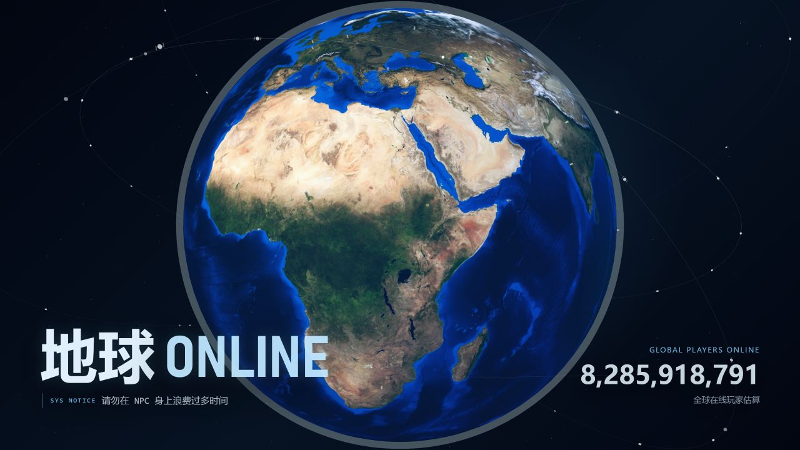

# Earth Online

一个本地优先、轻量、娱乐化表达的人生运行与记录原型。

Earth Online 借用“现实世界是一台长期运行的服务器”的世界观，把每日推进、状态、等级、称号与人生成就重新包装。它不是传统游戏，也不是待办清单或效率仪表盘。理想体验是：短暂登录现实世界，看见自己仍在运行，并留下少量向前移动的痕迹。



## 当前状态

项目目前是纯前端、本地运行的实验性原型：

- 无账号、无后端、无云同步。
- 存档保存在浏览器 `localStorage`，支持 JSON 导入与导出。
- 首页是一颗持续自转的 3D 地球，带云层、城市灯光、轨道与卫星信号。
- 双击地球进入更深层体验。
- 默认入口继续保留稳定的旧流程；新版 v0.4 建档体验通过功能开关单独预览。

> 在线玩家数量是基于世界人口基线的动态估值，用于世界观表达，不是真实同时在线人数。

## 核心体验

### 地球首页

- 明亮、真实的可旋转地球，而不是静态网页背景。
- 克制的轨道与卫星链，表现人类文明的通信痕迹。
- 极少的首页文字，只保留项目名称、系统提示与全球玩家估值。
- 双击地球后通过镜头聚焦进入系统。

### 每日运行

每日内容被收束为三个语义位置，避免把人生变成任务列表：

1. 一个真正重要的主线行动。
2. 一个很小的维护动作。
3. 一条可选的自由记录。

主线是绝对主角。维护和记录不会制造签到惩罚，也不会清空连续进度。

### v0.4 新建档预览

v0.4 用“地球表面直接提问”替代中心表单面板：

- 一次只出现一个问题。
- 只有玩家名称必填。
- 生日、人生阶段、MBTI 与当前主线均可跳过。
- MBTI 只接受玩家自行提交，不进行自动人格推断。
- 每答一题立即保存，刷新或退出后可以继续。
- 初始建档不会凭空发放经验、称号或旧成就。

预览地址：

```text
http://127.0.0.1:58804/?experience=v04
```

显式回滚到旧流程：

```text
http://127.0.0.1:58804/?experience=legacy
```

不带参数时默认使用旧流程。

### 夜间档案与成就

项目已包含夜间档案馆原型、成就目录、稀有度、隐私状态、旧存档候选确认与低干扰成就通知。成就用于记录真实经历，不提供金币、抽奖或战斗力。

当前仓库内的成就图标为统一风格的原型素材；未来正式资产仍需继续规范化。

## 本地运行

### 环境要求

- Node.js 18 或更高版本
- npm
- 支持 WebGL 的现代浏览器

### 安装与启动

```bash
git clone https://github.com/Rain-dust/earth-online.git
cd earth-online
npm install
npm start
```

默认访问：

```text
http://127.0.0.1:58804/
```

项目使用原生 ES Modules，没有构建步骤。`server.js` 只提供本地静态文件服务。

## 测试

```bash
npm test
```

测试覆盖主要业务规则，包括：

- 本地存档迁移与异常数据修复
- v0.4 功能开关与回滚路由
- 可恢复的新建档流程
- 每日运行与经验账本
- 主线生命周期
- 状态与维护任务选择
- 成就、旧存档确认与夜间过渡
- UI 标记、中文文案与响应式约束

## 数据与隐私

- 所有玩家数据默认只保存在当前浏览器。
- 项目不会上传生日、MBTI、状态、主线或活动记录。
- 清除浏览器站点数据会删除本地存档，请使用界面内的导出功能备份。
- 导入旧版存档时会执行兼容迁移，并尽量保留未知字段。
- 当前存档键保持为 `earth-online-save-v1`，内部 schema 会独立升级。

## 项目结构

```text
assets/                         地球纹理、云层与成就原型素材
docs/                           产品规格、实施计划与设计交接
src/app/                        页面状态与流程协调
src/core/                       存档、主线、每日运行、经验与成就规则
src/scene/                      Three.js 地球、镜头与昼夜场景
src/ui/                         首页、建档、晨间运行与夜间档案界面
tests/                          Node.js 原生测试
index.html                      页面入口
server.js                       本地静态服务器
```

关键文件：

- `src/scene/earth-scene.mjs`：地球渲染、镜头聚焦与昼夜过渡。
- `src/app/controller.mjs`：首页、连接、新建档、晨间与夜间流程协调。
- `src/core/storage.mjs`：本地存档、迁移和导入导出。
- `src/core/daily-run.mjs`：每日三个语义位置的业务规则。
- `src/core/main-quest.mjs`：唯一活跃主线的生命周期。
- `src/core/achievements.mjs`：成就记录、隐私与旧存档确认。

## 设计边界

Earth Online 当前明确不会优先建设：

- 账号、排行榜、好友或真实多人在线系统
- 金币、抽奖、商店、装备与战斗力
- 强制连续登录、断签惩罚或失败评价
- 需要长期生产地图、剧情与 3D 资产的大型个人宇宙

项目接下来的核心设计问题，是让双击地球后的每日体验摆脱传统中心面板，同时继续复用现有主线、维护、记录、等级和成就逻辑。完整背景见 [设计交接文档](docs/EARTH_ONLINE_DESIGN_HANDOFF_2026-07-18.md)。

## 开源参考

地球渲染与交互主要参考：

- [Three.js](https://threejs.org/)
- [three-globe](https://github.com/vasturiano/three-globe)
- [globe.gl](https://github.com/vasturiano/globe.gl)
- [Lucide](https://lucide.dev/)

纹理、云层、人口基线与具体参考链接记录在 [OPEN_SOURCE_REFERENCES.md](OPEN_SOURCE_REFERENCES.md)。

## 许可说明

当前仓库尚未添加项目级开源许可证。在许可证明确前，请将代码与视觉资产视为仅供查看、学习和协作验证；第三方素材仍遵循各自来源的许可条款。
